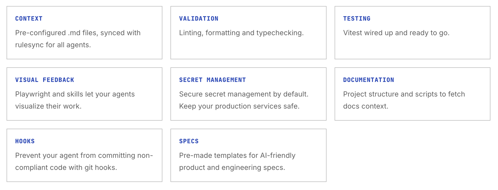

# Production Agentic Engineering Template

A Next.js starter template built for teams using AI agents to write production code.



## Template features

- **Centralized multi-agent AI context** — One source of truth for agent rules, auto-synced to Claude Code, Cursor, Gemini CLI, Copilot, Windsurf, and 11 other tools
- **AI-friendly validation** — Pre-configured linting, typechecking and formatting
- **Testing** — Testing ready to go with vitest
- **Git hooks** - Automate validation with git hooks (via lefthook)
- **Playwright browser automation** — Playwright CLI config and skill to ensure your agents can validate their own work visually
- **Local documentation** — Script to pull upstream docs (e.g. Tailwind) into the repo so agents have accurate, up-to-date reference material
- **Spec templates** — a structured format for writing feature specs that AI agents can reliably parse and implement from

**Tech stack:** Next.js, React, TypeScript, Tailwind, Vitest, Playwright CLI, ESLint, Prettier, Lefthook, pnpm

---

## Getting started

**Prerequisites:** Node.js 18+, pnpm

```bash
# Install dependencies
pnpm install

# Start the development server
pnpm dev
```

Open [http://localhost:3000](http://localhost:3000) to see the homepage.

---

## Key concepts

### Centralized agent rules (rulesync)

Switch between models and tools easily with automated rule sync across context files and skills. Write context once in .rulesync then use the automated commands to generate `CLAUDE.md`, `AGENTS.md`, `.cursor/rules/`, `GEMINI.md`, etc instantly.

```bash
pnpm rules:generate
```

### Local documentation

Ensure knowledge cut off dates are never an issue. The `/docs` directory and `docs:fetch` script keep your docs up to date and provide local context to agents.

```bash
pnpm docs:fetch
```

To add more documentation sources, edit `scripts/fetch-docs.sh`.

### Feature specs

The `/specs` directory contains an AI-friendly spec template (`_TEMPLATE.md`). Write specs in this format to maximize the chance of success when dispatching your agents.

Copy `_TEMPLATE.md`, fill it out for your feature, and reference it when prompting your agent.

### Playwright browser automation

The template includes a skill and Playwright CLI config that lets agents open a real browser, interact with your app, and take screenshots to verify their work visually. See `.rulesync/skills/playwright-cli/`.

---

## Project structure

```
.
├── app/                  # Next.js (pages, layout, styles)
├── lib/                  # Shared utilities
├── specs/                # Markdown feature spec (+ template)
├── docs/                 # Fetched upstream documentation (git-ignored)
├── scripts/              # fetch-docs.sh and other scripts
├── repositories/         # Clone source code to this repository for AI context
├── .rulesync/            # Source of truth for all agent context files
├── .rulesync.json        # rulesync confix
├── .env.example          # Example secrets and guidance
├── .prettierrc           # Formatting config
├── lefthook.yml          # Git hooks config
├── eslint.config.mjs     # Linter config
├── lefthook.yml          # Git hooks config
├── vitest.config.ts      # Vitest config
└── public/               # Static assets
```

Generated agent context files (do not edit directly):

```
CLAUDE.md, AGENTS.md, GEMINI.md, WARP.md, .goosehints
.cursor/rules/, .agent/rules/, .windsurf/rules/
```

---

## Scripts

| Command                             | Description                                          |
| ----------------------------------- | ---------------------------------------------------- |
| `pnpm dev`                          | Start development server                             |
| `pnpm build`                        | Production build                                     |
| `pnpm lint` / `pnpm lint:fix`       | Run ESLint                                           |
| `pnpm format` / `pnpm format:check` | Run Prettier                                         |
| `pnpm type-check`                   | TypeScript validation                                |
| `pnpm test` / `pnpm test:watch`     | Run Vitest                                           |
| `pnpm test:coverage`                | Run tests with coverage report                       |
| `pnpm rules:generate`               | Regenerate all agent context files from `.rulesync/` |
| `pnpm docs:fetch`                   | Pull upstream documentation into `/docs`             |

---

## Git hooks

Lefthook runs automatically on git events:

- **pre-commit** — ESLint, Prettier, and TypeScript run in parallel. Fixes are auto-staged.
- **pre-push** — Full test suite must pass.

This ensures every commit that lands in the repo has passed basic validation, regardless of which agent or human made the change.

---

## Environment variables

Copy `.env.example` to `.env.local` and fill in your values.

```bash
cp .env.example .env.local
```

Never commit real secrets. The `.env.example` file documents required variables with placeholder values.
